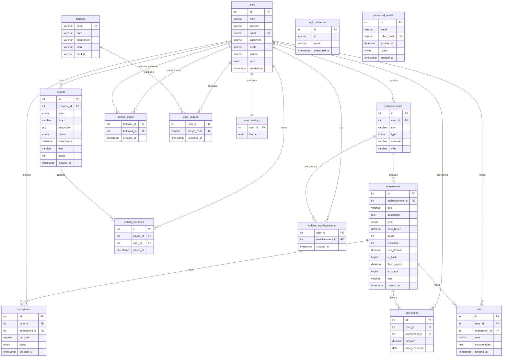

# Modèle Conceptuel de Données — StudentLink

## Diagramme Entité-Relation (Mermaid)

---

## Description des entités

### `users`
Utilisateurs de la plateforme. Deux rôles : `etudiant` et `partenaire`.  
Un partenaire possède un ou plusieurs `etablissements`.

### `etablissements`
Lieux partenaires (bar, boîte, resto, afterwork). Rattaché à un compte `partenaire`.

### `evenements`
Événements créés par les établissements. Peuvent être flash (expiration automatique), gratuits ou payants avec réduction.

### `inscriptions`
Lien étudiant ↔ événement. Statut : `inscrit` → `checkin` → `annule`. Contient le QR code unique.

### `squads`
Groupes sportifs créés par des étudiants. 4 types : running, vélo, muscu, autre.

### `squad_membres`
Table de jonction étudiants ↔ squads. Contrainte UNIQUE par couple (squad, user).

### `economies`
Montants économisés par chaque étudiant lors de ses inscriptions avec réduction.

### `follows_users`
Auto-référence sur `users`. Un étudiant peut en suivre un autre.

### `follows_etablissements`
Un étudiant peut suivre un établissement pour recevoir ses futures offres.

### `avis`
Note (1-5) + commentaire optionnel, laissé après un check-in validé. Unique par (user, événement).

### `badges`
9 badges définis (first_event, five_events, ten_events, first_squad, five_squads, first_follow, reviewer, early_bird, saver_50).

### `user_badges`
Badges débloqués par chaque utilisateur, avec la date de déverrouillage.

### `login_attempts`
Enregistre les tentatives de connexion par IP pour le rate limiting (anti-bruteforce).

### `password_resets`
Tokens de réinitialisation de mot de passe : hashé SHA-256, expiration 1h, usage unique.

---

## Contraintes principales

| Contrainte | Table | Colonnes |
|-----------|-------|---------|
| UNIQUE | `users` | `email` |
| UNIQUE | `inscriptions` | `(user_id, evenement_id)` |
| UNIQUE | `squad_membres` | `(squad_id, user_id)` |
| UNIQUE | `avis` | `(user_id, evenement_id)` |
| UNIQUE | `follows_users` | `(follower_id, followed_id)` |
| UNIQUE | `follows_etablissements` | `(user_id, etablissement_id)` |
| PK composite | `user_badges` | `(user_id, badge_code)` |
| FK CASCADE | toutes | `ON DELETE CASCADE` |
