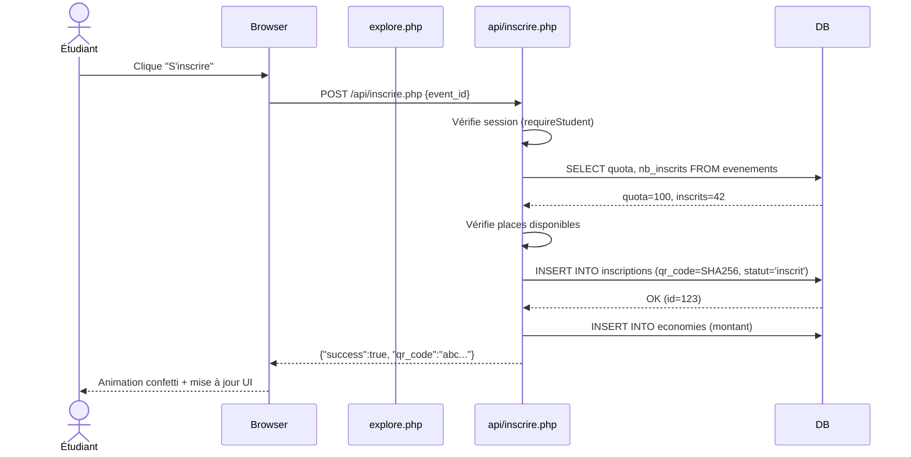
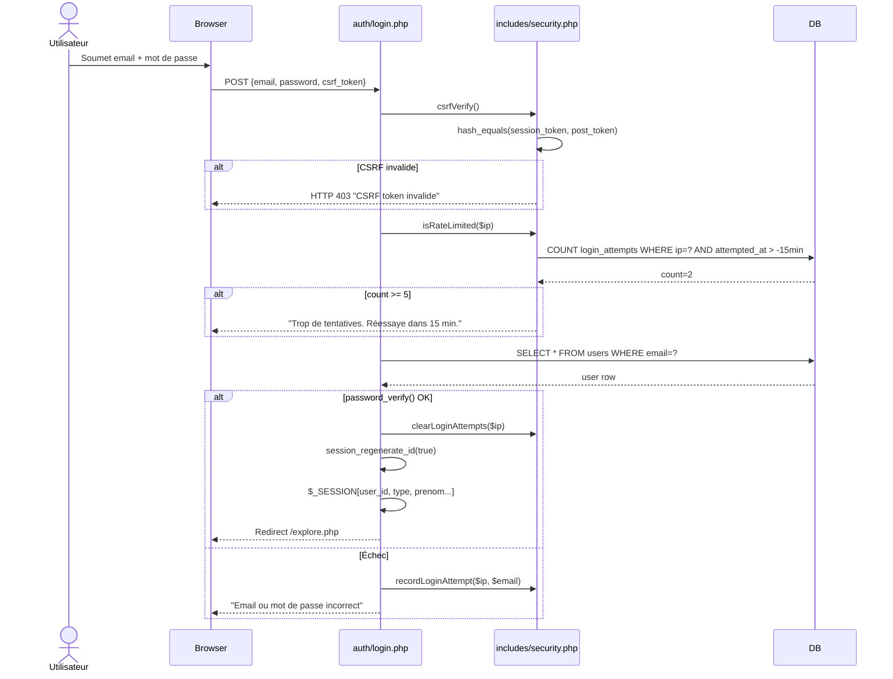
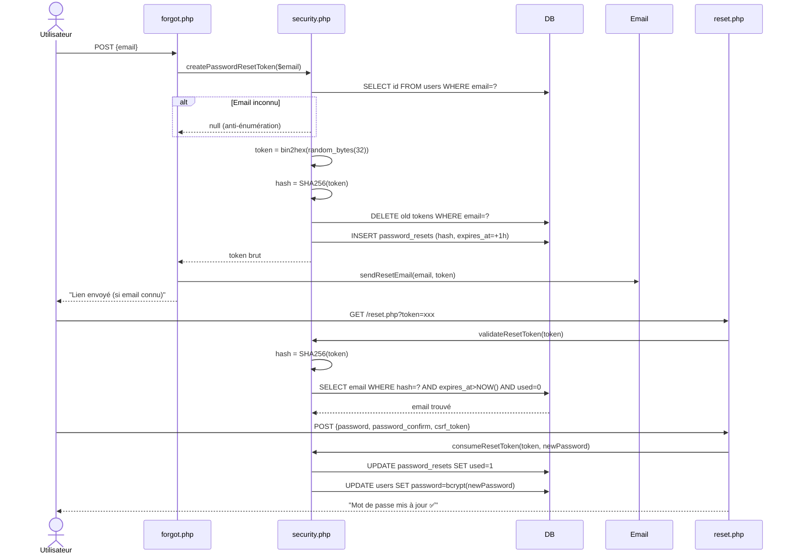
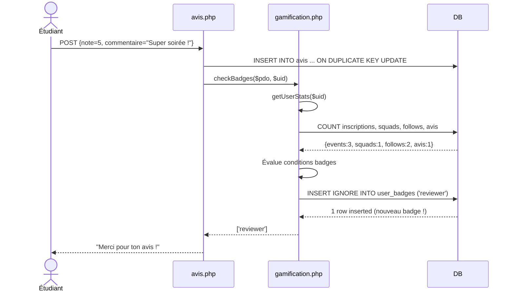
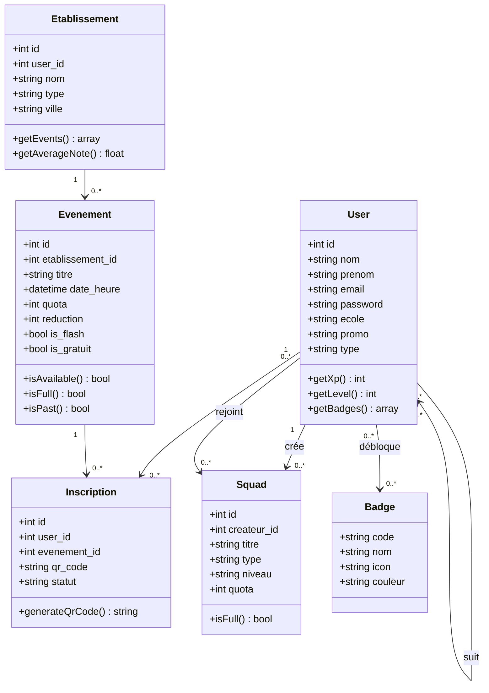

# Diagrammes UML — StudentLink

---

## 1. Diagramme de cas d'utilisation

```mermaid
graph TD
    Etudiant([👤 Étudiant])
    Partenaire([🏢 Partenaire])
    Visiteur([👁 Visiteur])

    subgraph Auth
        UC1[S'inscrire]
        UC2[Se connecter]
        UC3[Mot de passe oublié]
        UC4[Modifier son profil]
    end

    subgraph Événements
        UC5[Explorer les events]
        UC6[S'inscrire à un event]
        UC7[Annuler son inscription]
        UC8[Scanner son QR code]
        UC9[Laisser un avis]
    end

    subgraph Social
        UC10[Suivre un étudiant]
        UC11[Voir un profil]
        UC12[Créer une squad]
        UC13[Rejoindre une squad]
        UC14[Inviter à un event/squad]
    end

    subgraph Gamification
        UC15[Voir ses badges]
        UC16[Consulter son niveau XP]
        UC17[Activer le dark mode]
    end

    subgraph Wallet
        UC18[Voir ses pass]
        UC19[Voir ses économies]
    end

    subgraph Partenaire_UC
        UC20[Créer un événement]
        UC21[Gérer ses événements]
        UC22[Valider un check-in]
        UC23[Voir les analytics]
        UC24[Supprimer un événement]
    end

    Visiteur --> UC1
    Visiteur --> UC2
    Visiteur --> UC3

    Etudiant --> UC4
    Etudiant --> UC5
    Etudiant --> UC6
    Etudiant --> UC7
    Etudiant --> UC8
    Etudiant --> UC9
    Etudiant --> UC10
    Etudiant --> UC11
    Etudiant --> UC12
    Etudiant --> UC13
    Etudiant --> UC14
    Etudiant --> UC15
    Etudiant --> UC16
    Etudiant --> UC17
    Etudiant --> UC18
    Etudiant --> UC19

    Partenaire --> UC20
    Partenaire --> UC21
    Partenaire --> UC22
    Partenaire --> UC23
    Partenaire --> UC24
```

---

## 2. Diagramme de séquence — Inscription à un événement

---

## 3. Diagramme de séquence — Connexion avec rate limiting

---

## 4. Diagramme de séquence — Réinitialisation du mot de passe

---

## 5. Diagramme de séquence — Déblocage d'un badge

---

## 6. Diagramme de classes simplifié

